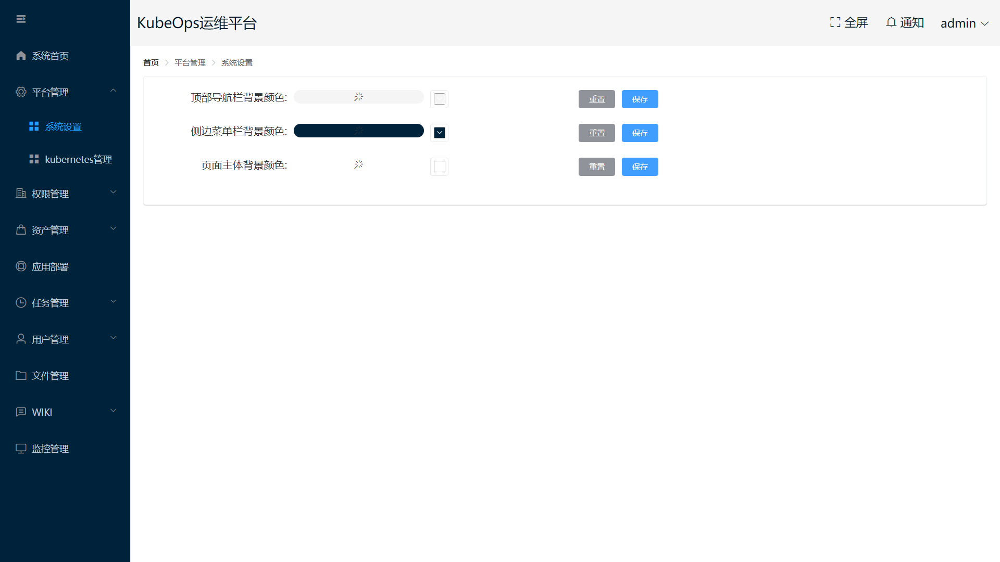
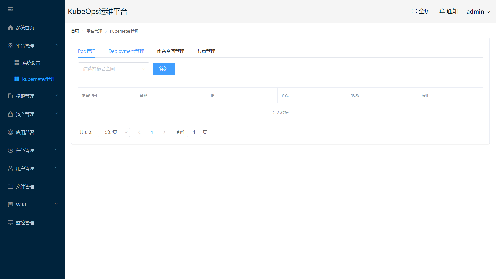
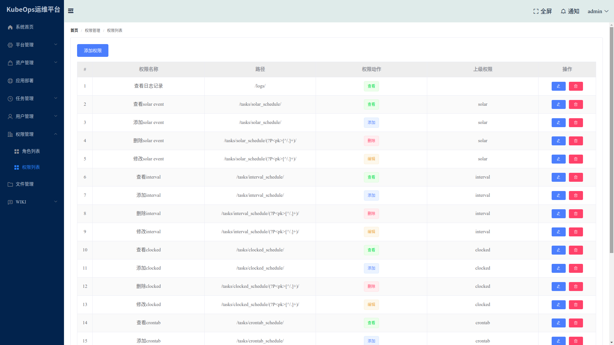
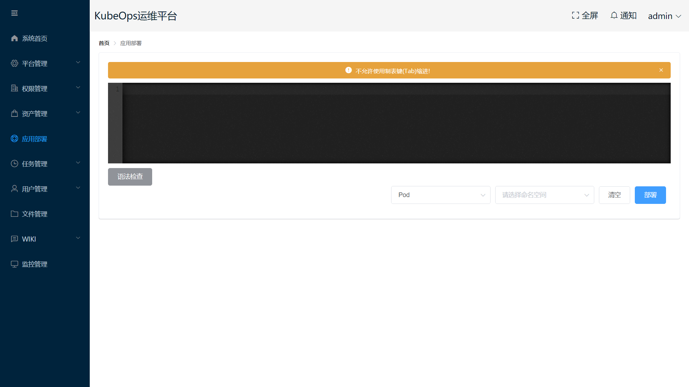
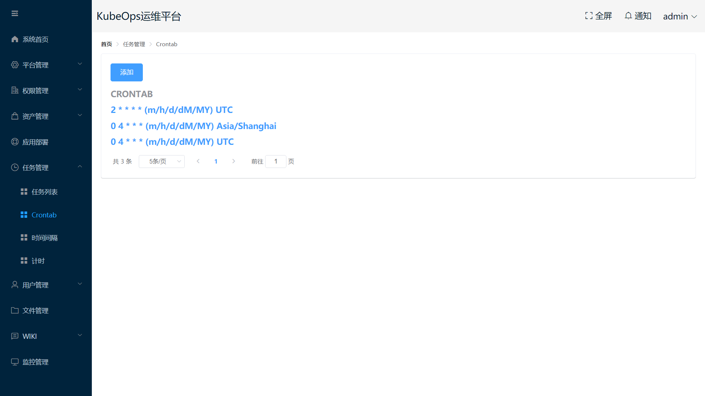
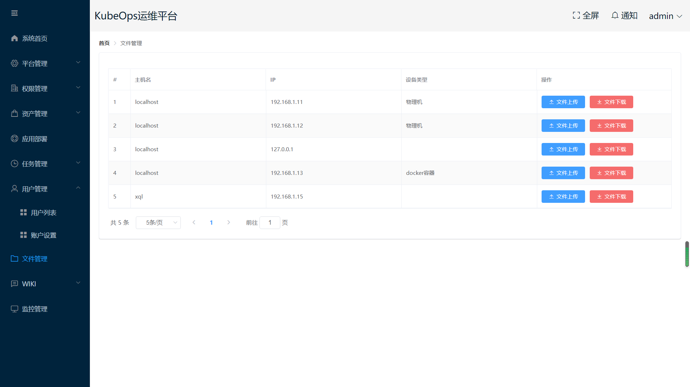
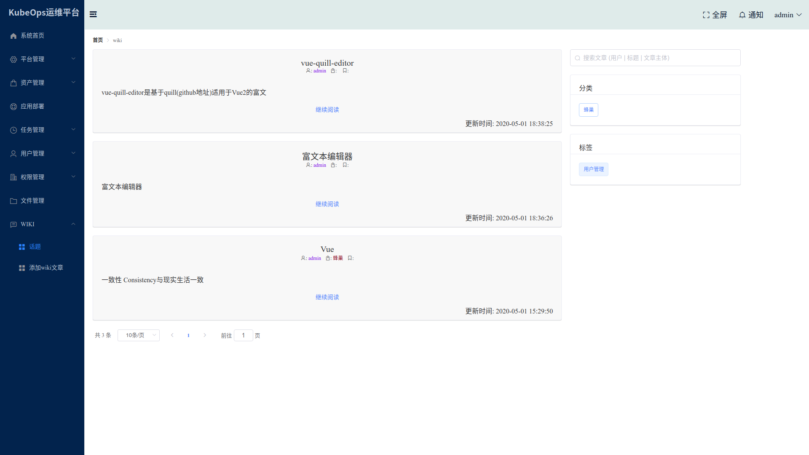

# KubeOps

KubeOps是针对kubernetes的运维管理平台，具有权限管理、kubernetes平台管理、远程操作、资产管理、任务管理、站内wiki等多项功能的运维平台。

现在已具有最基本的功能，更多功能正在完善中...

## 首页

## 平台管理

### 背景颜色配置

### k8s管理

## 权限管理

## 资产管理

### 主机管理

### 远程连接

## 应用部署

## 任务管理

### 任务列表

### crontab

## 用户管理

## 文件管理

## Wiki

